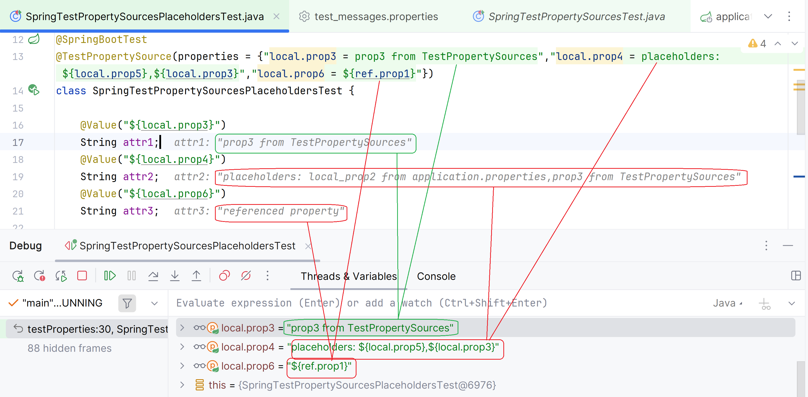

# Spring Boot configuration properties setting via @TestPropertySource annotation

- set properties in the custom *.properties file added via `@TestPropertySource#locations`
- set property values via `@TestPropertySource#properties`

Spring Debugger:

- properties are evaluated properly, but Source|Override navigation for the property evaluation results 
works only for the properties set in `application.properties`
  https://youtrack.jetbrains.com/issue/IDEA-365978/Spring-Debugger-properties-evaluation-navigation-to-source-fails-for-properties-set-in-test-annotations
  https://youtrack.jetbrains.com/issue/IDEA-365979/Spring-Debugger-properties-evaluation-navigation-to-source-fails-for-properties-set-in-the-additional-properties-files
  
- the properties that reference another properties via placeholders are not evaluated properly: 
the placeholders are not expanded
  https://youtrack.jetbrains.com/issue/IDEA-365980/Spring-Debugger-properties-evaluation-is-incorrect-for-properties-set-via-TestPropertySourceproperties-using-placeholders

